# Sistema de Autoatendimento para Lanchonete - Fase 2

Este é um projeto para o Tech Challenge da pós-graduação SOAT - **Fase 2: Kubernetes**.

**Aluno:** Anderson Fér - rm363691  
**Vídeo de demonstração:** [A ser adicionado]

## Descrição do Projeto

Sistema de autoatendimento para lanchonete implementado com arquitetura de microserviços rodando em cluster Kubernetes. O sistema permite pedidos sem interação com atendentes, processamento de pagamentos via mock do Mercado Pago e gerenciamento completo de pedidos na cozinha, com escalabilidade automática baseada em demanda.

## Fluxo de Negócio
O sistema segue um fluxo dividido em 3 etapas principais:

### 1. Cliente e Checkout


### 2. Processamento de Pagamento


### 3. Operações da Cozinha


## Tecnologias Utilizadas

- **Backend:** Java 17, Spring Boot 3.4.4, MySQL 8.0
- **Infraestrutura:** Kubernetes (Minikube), Docker, HPA
- **Arquitetura:** Clean Architecture, DDD, Microserviços

## Arquitetura do Sistema

### Visão Geral
Sistema distribuído em microserviços rodando em cluster Kubernetes (Minikube) com escalabilidade automática.

### Estrutura da Arquitetura

#### Organização de Diretórios
```
lanchonete-app/
├── autoatendimento/                 # Microserviço principal
│   ├── src/main/java/
│   │   ├── dominio/                 # Camada de Domínio (Clean Architecture)
│   │   │   ├── entidades/           # Entidades de negócio
│   │   │   ├── valueobjects/        # CPF, Email, Preco
│   │   │   └── enums/               # StatusPedido, Categoria
│   │   ├── aplicacao/               # Camada de Aplicação
│   │   │   ├── casosdeuso/          # Use Cases por contexto
│   │   │   └── portas/              # Interfaces para gateways
│   │   ├── adaptadores/             # Camada de Adaptadores
│   │   │   ├── rest/                # Controllers e Services
│   │   │   └── gateways/            # Implementação de portas
│   │   └── infra/                   # Camada de Infraestrutura
│   └── Dockerfile
├── pagamento/                       # Mock Mercado Pago
├── k8s/                            # Manifests Kubernetes
│   ├── deployments/                 # Deployments e StatefulSets
│   ├── services/                    # Services (NodePort, ClusterIP)
│   ├── configmaps/                  # Configurações não sensíveis
│   ├── secrets/                     # Credenciais e dados sensíveis
│   ├── storage/                     # PersistentVolumes e PVCs
│   └── hpa/                         # HorizontalPodAutoscaler
├── aplicar_manifests.sh             # Script de deploy automatizado
├── validar_deploy_k8s.sh           # Script de validação
├── teste-carga-hpa.sh              # Script de teste de escalabilidade
└── limpar_k8s.sh                   # Script de limpeza
```

#### Kubernetes



**APLICAÇÕES:**
- autoatendimento-deployment (2-4 pods) → lanchonete-app-autoatendimento:latest
- pagamento-deployment (2-4 pods) → lanchonete-app-pagamento:latest

**SERVIÇOS DE REDE:**
- autoatendimento-service (NodePort 30080) → autoatendimento pods
- pagamento-service (NodePort 30081) → pagamento pods
- mysql-service (ClusterIP 3306) → mysql pod

**BANCO DE DADOS:**
- mysql-statefulset (1 pod) + PersistentVolume 10Gi

**CONFIGURAÇÕES:**
- ConfigMaps: autoatendimento-config, pagamento-config
- Secrets: mysql-secret (credenciais do banco)

**ESCALABILIDADE:**
- HPA autoatendimento: 2-4 pods (CPU target 60%)
- HPA pagamento: 2-4 pods (Memory target 90%)

**ACESSO EXTERNO:**
- Autoatendimento: http://minikube-ip:30080
- Pagamento: http://minikube-ip:30081


## APIs Disponíveis

### 🍔 **Serviço Autoatendimento** ($(minikube ip):30080)

#### **Clientes**

##### **POST /clientes** - Cadastrar cliente
```bash
curl -X POST "http://$(minikube ip):30080/clientes" \
  -H "Content-Type: application/json" \
  -d '{
    "nome": "João Silva",
    "cpf": "12345678901",
    "email": "joao.silva@email.com"
  }'
```

##### **GET /clientes/cpf/{cpf}** - Buscar cliente por CPF
```bash
curl -X GET "http://$(minikube ip):30080/clientes/cpf/12345678901"
```

#### **Produtos**

##### **GET /produtos/categoria/{categoria}** - Buscar produtos por categoria

**1. Lanches:**
```bash
curl -X GET "http://$(minikube ip):30080/produtos/categoria/LANCHE"
```

---

**2. Bebidas:**
```bash
curl -X GET "http://$(minikube ip):30080/produtos/categoria/BEBIDA"
```

---

**3. Acompanhamentos:**
```bash
curl -X GET "http://$(minikube ip):30080/produtos/categoria/ACOMPANHAMENTO"
```

---

**4. Sobremesas:**
```bash
curl -X GET "http://$(minikube ip):30080/produtos/categoria/SOBREMESA"
```

#### **Pedidos**

##### **POST /pedidos/checkout** - Realizar checkout de pedido

**1. Pedido com cliente identificado:**
```bash
curl -X POST "http://$(minikube ip):30080/pedidos/checkout" \
  -H "Content-Type: application/json" \
  -d '{
    "cpfCliente": "12345678901",
    "itens": [
      {
        "produtoId": 1,
        "quantidade": 2
      },
      {
        "produtoId": 3,
        "quantidade": 1
      }
    ]
  }'
```

---

**2. Pedido sem identificação do cliente:**
```bash
curl -X POST "http://$(minikube ip):30080/pedidos/checkout" \
  -H "Content-Type: application/json" \
  -d '{
    "cpfCliente": null,
    "itens": [
      {
        "produtoId": 1,
        "quantidade": 1
      }
    ]
  }'
```

##### **GET /pedidos** - Listar todos os pedidos
```bash
curl -X GET "http://$(minikube ip):30080/pedidos"
```

##### **GET /pedidos/{id}/pagamento/status** - Consultar status de pagamento
```bash
curl -X GET "http://$(minikube ip):30080/pedidos/1/pagamento/status"
```

#### **Cozinha**

##### **GET /pedidos/cozinha** - Listar pedidos da cozinha (ordenados por prioridade)
```bash
curl -X GET "http://$(minikube ip):30080/pedidos/cozinha"
```

##### **PUT /pedidos/cozinha/{id}/status** - Atualizar status de pedidos

**1. Marcar pedido como em preparação:**
```bash
curl -X PUT "http://$(minikube ip):30080/pedidos/cozinha/1/status" \
  -H "Content-Type: application/json" \
  -d '{
    "status": "EM_PREPARACAO"
  }'
```

---

**2. Marcar pedido como pronto:**
```bash
curl -X PUT "http://$(minikube ip):30080/pedidos/cozinha/1/status" \
  -H "Content-Type: application/json" \
  -d '{
    "status": "PRONTO"
  }'
```

---

**3. Finalizar pedido:**
```bash
curl -X PUT "http://$(minikube ip):30080/pedidos/cozinha/1/status" \
  -H "Content-Type: application/json" \
  -d '{
    "status": "FINALIZADO"
  }'
```

**Status disponíveis:** `RECEBIDO`, `EM_PREPARACAO`, `PRONTO`, `FINALIZADO`

##### **POST /produtos** - Criar produto
```bash
curl -X POST "http://$(minikube ip):30080/produtos" \
  -H "Content-Type: application/json" \
  -d '{
    "nome": "Novo Lanche",
    "descricao": "Descrição do novo lanche",
    "preco": 22.90,
    "categoria": "LANCHE"
  }'
```

##### **PUT /produtos/{id}** - Editar produto
```bash
curl -X PUT "http://$(minikube ip):30080/produtos/5" \
  -H "Content-Type: application/json" \
  -d '{
    "nome": "Lanche Editado",
    "descricao": "Nova descrição do lanche",
    "preco": 25.90,
    "categoria": "LANCHE"
  }'
```

##### **DELETE /produtos/{id}** - Remover produto
```bash
curl -X DELETE "http://$(minikube ip):30080/produtos/5"
```

### 💳 **Serviço Pagamento** ($(minikube ip):30081)

#### **Pagamentos**

##### **POST /pagamentos** - Processar pagamento (Mock Mercado Pago)
```bash
curl -X POST "http://$(minikube ip):30081/pagamentos" \
  -H "Content-Type: application/json" \
  -d '{
    "pedidoId": "1",
    "valor": 46.70
  }'
```

### 📖 **Documentação**
- **Autoatendimento:** http://$(minikube ip):30080/swagger-ui/index.html
- **Pagamento:** http://$(minikube ip):30081/swagger-ui/index.html

## Como Executar

### Pré-requisitos
- **Minikube** instalado e funcionando
- **kubectl** configurado
- **Docker** (para build das imagens)
- **Git**

### 1. Setup do Ambiente

**Iniciar Minikube:**
```bash
minikube start
minikube addons enable metrics-server
```

**Clonar o repositório:**
```bash
git clone https://github.com/andersonfer/lanchonete-app.git
cd lanchonete-app
```

### 2. Build das Imagens

```bash
# Build das aplicações
docker-compose build

# Carregar imagens no Minikube
minikube image load lanchonete-app-autoatendimento:latest
minikube image load lanchonete-app-pagamento:latest
```

### 3. Deploy no Kubernetes

```bash
# Deploy completo (ordem automatizada)
chmod +x aplicar_manifests.sh
./aplicar_manifests.sh
```

**Ou deploy manual por etapas:**
```bash
# 1. Configurações
bash k8s/secrets/create-secrets.sh
kubectl apply -f k8s/configmaps/

# 2. Storage e MySQL
kubectl apply -f k8s/storage/
kubectl apply -f k8s/deployments/mysql-statefulset.yaml
kubectl apply -f k8s/services/mysql-services.yaml

# 3. Aplicações
kubectl apply -f k8s/deployments/
kubectl apply -f k8s/services/app-services.yaml

# 4. Escalabilidade
kubectl apply -f k8s/hpa/
```

### 4. Verificar Deploy

```bash
# Status geral
kubectl get pods,services,hpa

# Validação completa
chmod +x validar_deploy_k8s.sh
./validar_deploy_k8s.sh
```

### 5. Acessar Aplicações

```bash
# Obter IP do Minikube
minikube ip
```

**URLs de Acesso:**
- **Autoatendimento:** http://[minikube-ip]:30080
- **Swagger Autoatendimento:** http://[minikube-ip]:30080/swagger-ui/index.html
- **Pagamento:** http://[minikube-ip]:30081
- **Swagger Pagamento:** http://[minikube-ip]:30081/swagger-ui/index.html

### 6. Limpeza (Opcional)

```bash
# Remover todos os recursos
chmod +x limpar_k8s.sh
./limpar_k8s.sh
```

## Testando o Sistema

### Teste Automatizado Completo

```bash
# Executar teste completo de todos os endpoints
chmod +x fluxo_completo.sh
./fluxo_completo.sh
```

### Teste Manual Passo a Passo

Obtenha o IP do Minikube:
```bash
MINIKUBE_IP=$(minikube ip)
```

#### **1. Verificar Produtos Disponíveis**

```bash
# Listar produtos por categoria
curl "http://$MINIKUBE_IP:30080/produtos/categoria/LANCHE"
curl "http://$MINIKUBE_IP:30080/produtos/categoria/BEBIDA"
curl "http://$MINIKUBE_IP:30080/produtos/categoria/ACOMPANHAMENTO"
curl "http://$MINIKUBE_IP:30080/produtos/categoria/SOBREMESA"
```

#### **2. Fluxo Completo de Pedido**

**2.1 Checkout do Pedido (capturar ID):**
```bash
PEDIDO_RESPONSE=$(curl -s -X POST "http://$MINIKUBE_IP:30080/pedidos/checkout" \
  -H "Content-Type: application/json" \
  -d '{
    "cpfCliente": "12345678901",
    "itens": [
      {"produtoId": 1, "quantidade": 2},
      {"produtoId": 2, "quantidade": 1}
    ]
  }')

# Extrair apenas o PRIMEIRO ID (do pedido principal)
PEDIDO_ID=$(echo $PEDIDO_RESPONSE | grep -o '"id":[0-9]*' | head -n1 | cut -d':' -f2)
echo "Pedido criado com ID: $PEDIDO_ID"
```

**2.2 Processar Pagamento (usando ID capturado):**
```bash
curl -X POST "http://$MINIKUBE_IP:30081/pagamentos" \
  -H "Content-Type: application/json" \
  -d "{\"pedidoId\": \"$PEDIDO_ID\", \"valor\": 35.80}"
```

**2.3 Aguardar Webhook (5 segundos) e Verificar Status:**
```bash
sleep 5
curl "http://$MINIKUBE_IP:30080/pedidos/$PEDIDO_ID/pagamento/status"
```
*Resposta esperada: `"APROVADO"` ou `"REJEITADO"`*

#### **3. Gerenciar Pedidos na Cozinha**

**3.1 Listar Pedidos da Cozinha (inicial):**
```bash
curl "http://$MINIKUBE_IP:30080/pedidos/cozinha"
```

**3.2 Atualizar Status do Pedido (usando ID capturado):**
```bash
# RECEBIDO → EM_PREPARACAO
curl -X PUT "http://$MINIKUBE_IP:30080/pedidos/cozinha/$PEDIDO_ID/status" \
  -H "Content-Type: application/json" \
  -d '{"status": "EM_PREPARACAO"}'

# Verificar mudança na cozinha
curl "http://$MINIKUBE_IP:30080/pedidos/cozinha"

# EM_PREPARACAO → PRONTO  
curl -X PUT "http://$MINIKUBE_IP:30080/pedidos/cozinha/$PEDIDO_ID/status" \
  -H "Content-Type: application/json" \
  -d '{"status": "PRONTO"}'

# Verificar mudança na cozinha (deve aparecer no topo por prioridade)
curl "http://$MINIKUBE_IP:30080/pedidos/cozinha"

# PRONTO → FINALIZADO
curl -X PUT "http://$MINIKUBE_IP:30080/pedidos/cozinha/$PEDIDO_ID/status" \
  -H "Content-Type: application/json" \
  -d '{"status": "FINALIZADO"}'

# Verificar que removeu da cozinha
curl "http://$MINIKUBE_IP:30080/pedidos/cozinha"
```

#### **4. Verificar Pedido Finalizado**

```bash
# Verificar que não aparece mais na cozinha
curl "http://$MINIKUBE_IP:30080/pedidos/cozinha"

# Mas ainda aparece na lista geral
curl "http://$MINIKUBE_IP:30080/pedidos"
```

#### **5. Testar Cliente Anônimo**

```bash
# Checkout sem CPF
PEDIDO_ANONIMO_RESPONSE=$(curl -s -X POST "http://$MINIKUBE_IP:30080/pedidos/checkout" \
  -H "Content-Type: application/json" \
  -d '{
    "cpfCliente": null,
    "itens": [
      {"produtoId": 1, "quantidade": 1}
    ]
  }')

PEDIDO_ANONIMO_ID=$(echo $PEDIDO_ANONIMO_RESPONSE | grep -o '"id":[0-9]*' | head -n1 | cut -d':' -f2)
echo "Pedido anônimo criado com ID: $PEDIDO_ANONIMO_ID"

# Processar pagamento do pedido anônimo
curl -X POST "http://$MINIKUBE_IP:30081/pagamentos" \
  -H "Content-Type: application/json" \
  -d "{\"pedidoId\": \"$PEDIDO_ANONIMO_ID\", \"valor\": 18.90}"
```

#### **6. Testar CRUD de Produtos**

```bash
# Criar produto
PRODUTO_RESPONSE=$(curl -s -X POST "http://$MINIKUBE_IP:30080/produtos" \
  -H "Content-Type: application/json" \
  -d '{
    "nome": "Produto Teste", 
    "descricao": "Produto para teste", 
    "preco": 15.50, 
    "categoria": "LANCHE"
  }')

PRODUTO_ID=$(echo $PRODUTO_RESPONSE | grep -o '"id":[0-9]*' | head -n1 | cut -d':' -f2)
echo "Produto criado com ID: $PRODUTO_ID"

# Editar produto
curl -X PUT "http://$MINIKUBE_IP:30080/produtos/$PRODUTO_ID" \
  -H "Content-Type: application/json" \
  -d '{
    "nome": "Produto Teste Editado", 
    "descricao": "Produto editado", 
    "preco": 17.90, 
    "categoria": "LANCHE"
  }'

# Deletar produto
curl -X DELETE "http://$MINIKUBE_IP:30080/produtos/$PRODUTO_ID"
```

#### **7. Testar CRUD de Clientes**

```bash
# Cadastrar cliente
curl -X POST "http://$MINIKUBE_IP:30080/clientes" \
  -H "Content-Type: application/json" \
  -d '{
    "cpf": "98765432100",
    "nome": "Cliente Teste",
    "email": "teste@email.com"
  }'

# Buscar cliente por CPF
curl "http://$MINIKUBE_IP:30080/clientes/cpf/98765432100"
```


## Escalabilidade (HPA)

### Configuração Atual

O sistema está configurado com **Horizontal Pod Autoscaler** para ajustar automaticamente o número de pods baseado na demanda:

**Autoatendimento:**
- **Mínimo:** 2 pods
- **Máximo:** 4 pods
- **Métrica:** CPU 60%
- **Comportamento:** Scale up em 1 minuto, scale down em 3 minutos

### Testar Escalabilidade

#### **Executar Teste de Carga Automatizado**

```bash
# Teste de 5 minutos com escalabilidade automática
chmod +x teste-carga-hpa.sh
./teste-carga-hpa.sh
```

#### **Monitoramento em Tempo Real**

**Em terminal separado, acompanhe a escalabilidade:**
```bash
# Monitorar HPA (atualização contínua)
kubectl get hpa -w

# Monitorar pods (criação/destruição)
kubectl get pods -l app=autoatendimento -w

# Monitorar métricas de CPU
watch kubectl top pods -l app=autoatendimento
```

### Comportamento Esperado

**Durante Carga Alta:**
- CPU aumenta de ~6% para 60%+
- HPA escala de 2 para 3-4 pods em ~1-2 minutos
- Requisições distribuídas entre pods

**Após Carga:**
- CPU retorna para ~6%
- HPA aguarda 3 minutos de estabilização
- Scale down gradual para 2 pods

**Tempos Típicos:**
- **Scale Up:** 1-2 minutos
- **Scale Down:** 3-5 minutos
- **Estabilização:** 5-10 minutos total

## Limpeza

### Remover Todos os Recursos

```bash
# Remover todos os recursos do projeto
chmod +x limpar_k8s.sh
./limpar_k8s.sh
```

---

**Tech Challenge SOAT - Fase 2**  
**Sistema de Autoatendimento com Kubernetes e Escalabilidade Automática**