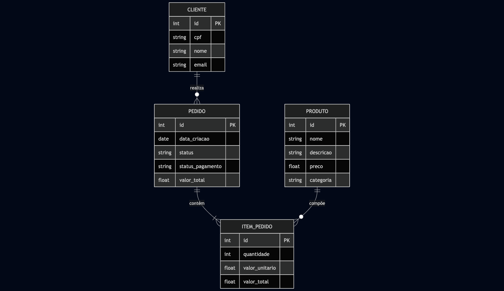
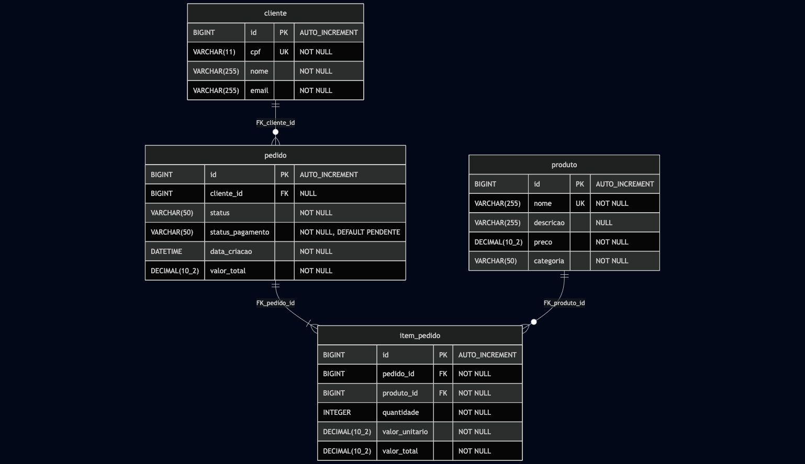

# Sistema de Autoatendimento - Modelagem e Estrutura de Banco de Dados

## 1. Contexto

Este documento apresenta a modelagem conceitual (MER) e lógica/física (DER) do banco de dados do sistema de autoatendimento para lanchonete, além das melhorias implementadas para otimizar a performance das consultas mais frequentes sem alterar o funcionamento da aplicação.

## 2. Modelo Conceitual (MER)

O Modelo Entidade-Relacionamento (MER) apresenta as entidades principais **Cliente**, **Pedido**, **Produto** e **Item de Pedido** (tabela associativa), bem como seus relacionamentos:

- **Cliente** `1:N` **Pedido** - Um cliente realiza vários pedidos
- **Pedido** `1:N` **Item de Pedido** - Um pedido contém vários itens
- **Produto** `1:N` **Item de Pedido** - Um produto compõe vários itens de pedido



## 3. Modelo Lógico/Físico (DER)

O Modelo Entidade-Relacionamento Físico (DER) mostra as tabelas **cliente**, **pedido**, **produto** e **item_pedido**, suas colunas, tipos de dados, chaves primárias e estrangeiras.



## 4. Melhorias Implementadas

Para otimizar a performance das consultas mais frequentes no sistema, foram criados índices estratégicos nas seguintes colunas:

### Índices Criados

```sql
CREATE INDEX idx_produto_categoria ON produto(categoria);
CREATE INDEX idx_pedido_status ON pedido(status);
CREATE INDEX idx_pedido_status_pagamento ON pedido(status_pagamento);
CREATE INDEX idx_pedido_data_criacao ON pedido(data_criacao);
CREATE INDEX idx_item_pedido_pedido_id ON item_pedido(pedido_id);
CREATE INDEX idx_item_pedido_produto_id ON item_pedido(produto_id);
```

### Impacto das Melhorias

Os índices foram implementados para melhorar a performance das seguintes operações:
- Listagem de produtos filtrados por categoria (LANCHE, BEBIDA, ACOMPANHAMENTO, SOBREMESA)
- Consultas de pedidos por status no painel operacional da cozinha
- Verificação de status de pagamento dos pedidos
- Ordenação cronológica de pedidos
- Consulta de itens de um pedido específico
- Geração de relatórios de vendas por produto

## 5. Justificativa da Escolha do MySQL

O MySQL foi escolhido por sua conformidade ACID essencial para transações financeiras, suporte nativo no AWS RDS que facilita gerenciamento e escalabilidade em cloud, e performance adequada para cargas OLTP com sistema de índices eficiente para as consultas frequentes do sistema de autoatendimento.

## 6. Scripts de Banco de Dados

Os scripts SQL estão localizados em `infra/database/scripts/`:
- `001_schema.sql` - Criação das tabelas e índices
- `002_data.sql` - Carga inicial de dados (produtos e cliente de teste)