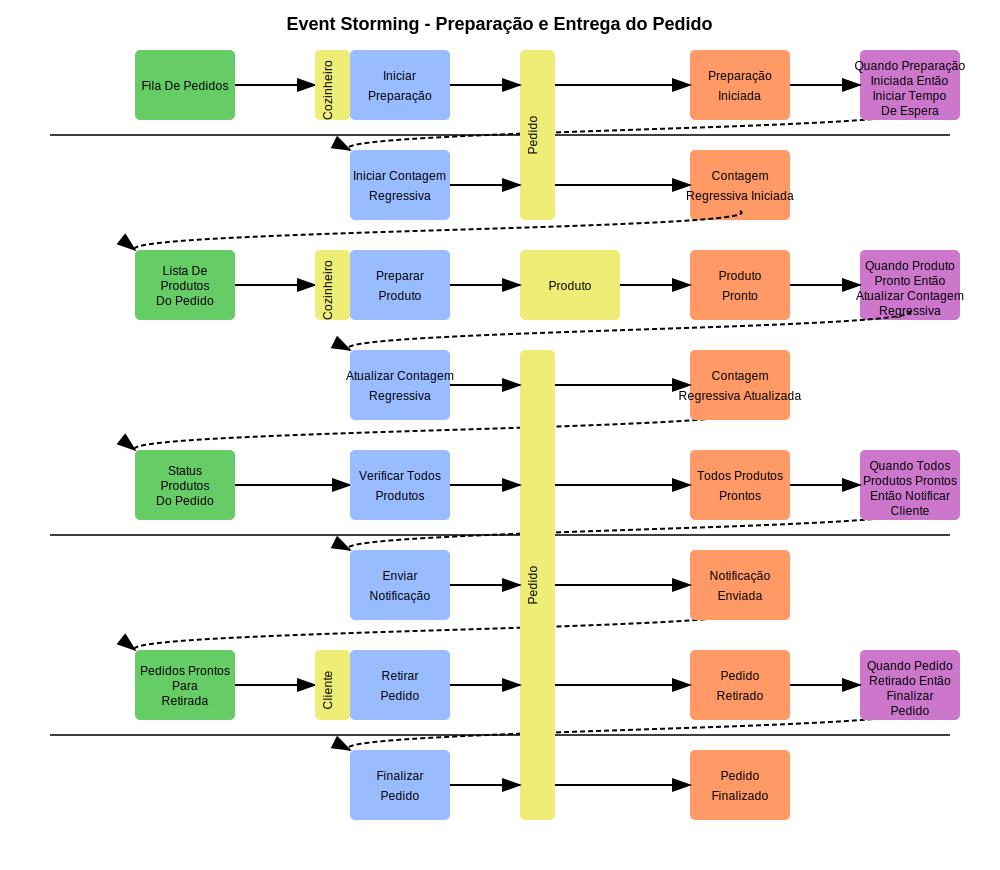

# Sistema de Autoatendimento para Lanchonete

Este é um projeto para o Tech Challenge da pós-graduação SOAT - fase 1.

## Descrição do Projeto

Sistema de autoatendimento para uma lanchonete de bairro, permitindo que os clientes façam pedidos sem interagir com um atendente.

## Tecnologias Utilizadas

- Java 17
- Spring Boot 3.4.4
- Spring JDBC
- H2 Database (desenvolvimento)
- MySQL (produção)
- Lombok
- SpringDoc OpenAPI (Swagger)
- Docker

## Estrutura do Projeto

O projeto segue os princípios da Arquitetura Hexagonal (Ports and Adapters):

```
br.com.lanchonete.autoatendimento
├── dominio                          # Entidades e regras de negócio
├── aplicacao
│   ├── dto                          # DTOs para request e response
│   ├── excecao                      # Exceções personalizadas
│   ├── portas
│   │   ├── entrada                  # Interfaces de casos de uso (UC)
│   │   └── saida                    # Interfaces para recursos externos
│   └── casosdeuso                   # Implementações dos casos de uso
├── adaptadores
│   ├── rest                         # Controllers REST (adaptadores de entrada)
│   ├── persistencia                 # Implementações JDBCs (adaptadores de saída)
│   └── util                         # Classes utilitárias
└── infra                            # Configurações de infraestrutura
```

## Como Executar

### Pré-requisitos
- Java 17 ou superior
- Maven
- Docker
- Git


### Executando com Docker Compose

1. Clone o repositório:
```bash
git clone https://github.com/andersonfer/lanchonete-app.git
cd lanchonete-app
```

2. Execute o Docker Compose:
```bash
docker compose up
```

3. Acesse a documentação Swagger:
```
http://localhost:8080/swagger-ui.html
```

### Executando Localmente (Desenvolvimento)

1. Clone o repositório:
```bash
git clone https://github.com/andersonfer/lanchonete-app.git
cd lanchonete-app
```

2. Execute o aplicativo com Maven:
```bash
mvn spring-boot:run
```

3. Acesse o console H2 (ambiente de desenvolvimento):
```
http://localhost:8080/h2-console
```
- JDBC URL: `jdbc:h2:mem:lanchonetedb`
- Usuário: `sa`
- Senha: (deixar em branco)

4. Acesse a documentação Swagger:
```
http://localhost:8080/swagger-ui.html
```

## APIs Implementadas

- **Cliente**:
  - Cadastro do Cliente
  - Identificação do Cliente via CPF
- **Produto**:
  - Criar, editar e remover produtos
  - Buscar produtos por categoria
- **Pedido**:
  - Realizar Pedido
  - Listar pedidos

## Event Storming - Realização do pedido e pagamento


## Event Storming - Preparação e entrega de pedidos



### Legenda:
- 🟩 Modelo de Leitura
- 🟨 Agregado
- 🟦 Comando
- 🟧 Evento
- 🟪 Política
